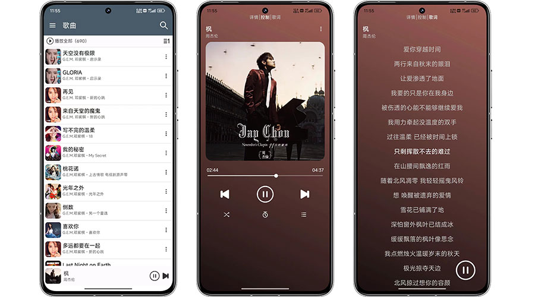

畅乐云听—阿里云盘音乐播放器

畅乐云听是一款播放阿里云盘MP3音乐文件的安卓播放器，可读取文件内嵌标签信息，点击[Releases](https://github.com/socue/ChangYueCloudMusicPublic/releases)下载最新安卓版本

### 使用方法

1.  手机需要安装最新版**阿里云盘App**
2.  第一次使用，需要先在阿里云盘”**备份文件**“下创建”**畅乐云听**“目录，完整的路径应该为：**全部文件>备份文件>畅乐云听**
3.  将包含标签信息的歌曲MP3文件，通过云盘客户端上传至畅乐云听文件夹内
4.  打开畅乐云听APP按提示授权后即可拉取云盘音乐

软件截图  

